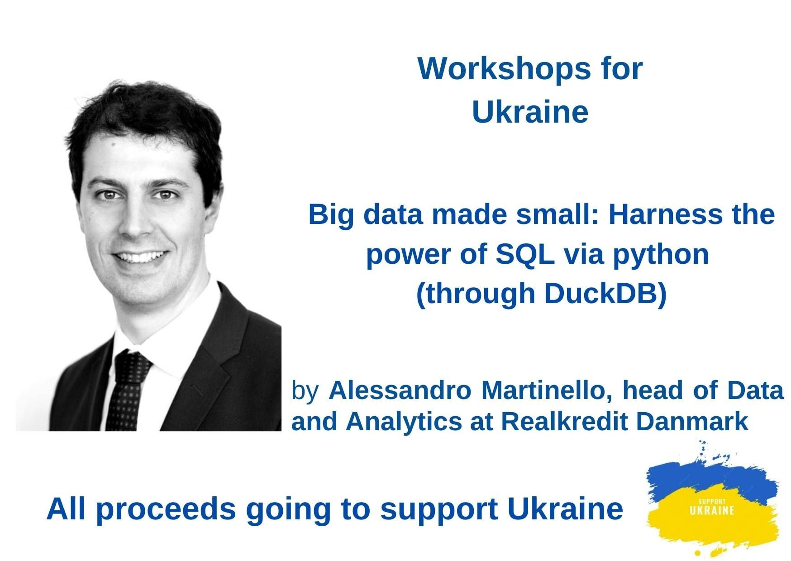

# Big Data Made Small: Workshop for Ukraine

This repository contains the material for the [Workshop for Ukraine](https://sites.google.com/view/dariia-mykhailyshyna/main/r-workshops-for-ukraine#h.3dg44e5elwsy) organized by [Dariia Mykhailyshyna](https://sites.google.com/view/dariia-mykhailyshyna/main), and scheduled for December 12th 2024.

You can find a copy of the slides in [`slides/BigDataMadeSmall.pdf`](slides/BigDataMadeSmall.pdf).

## Setup

Steps 1-3 are only required the first time you set up the folder.

1) Install [uv](https://docs.astral.sh/uv/), an extremely fast Python package manager, according to [these instructions](https://docs.astral.sh/uv/getting-started/installation/).

2) Git clone this repository to your chosen directory and change directory
```bash
git clone git@github.com:alemartinello/BigDataMadeSmall.git
cd BigDataMadeSmall
```

3) Create the main dataset we'll be using during this workshop (simulated). It will take a few minutes to run.
```bash
uv run create_data.py   
```

4) Open jupyter and select the notebook
```bash
uv run jupyter lab .
```

